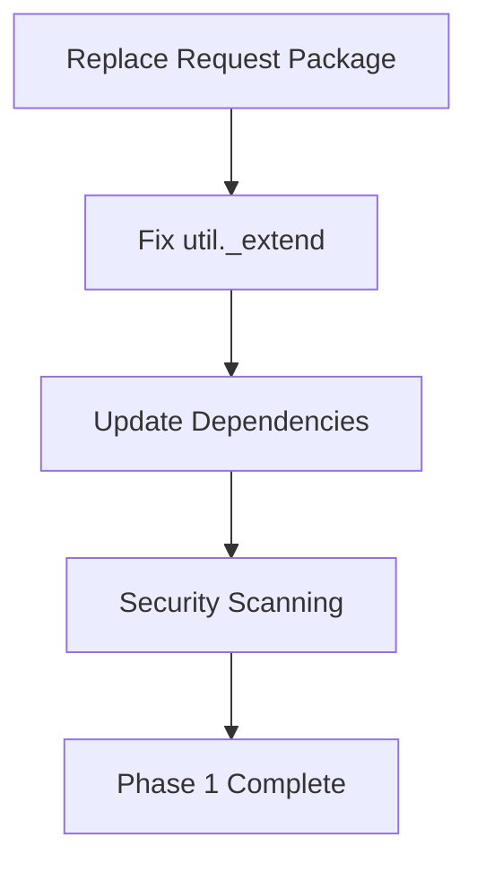

# Strong-Remoting Modernization Work Plan

## Overview

This document provides a detailed implementation plan for modernizing the strong-remoting package based on the comprehensive analysis in `docs/modernization-recommendations.md`. Each task includes specific acceptance criteria, technical specifications, and validation procedures.

## Project Structure and Branching Strategy

### Branch Strategy
- `main`: Production-ready code
- `modernization/phase-1`: Phase 1 security fixes
- `modernization/phase-2`: Core API modernization
- `modernization/phase-3`: Testing infrastructure
- `modernization/phase-4`: Performance optimizations

### Feature Branches
- `feature/replace-request-package`
- `feature/fix-util-extend`
- `feature/update-vulnerable-deps`
- `feature/async-await-support`
- `feature/test-modernization`

## Phase 1: Critical Security Fixes (Weeks 1-2)

### Task 1.1: Replace Deprecated Request Package
**Priority**: Critical | **Estimated Effort**: 3-4 days | **Risk Level**: High

#### Technical Specifications
**Files to Modify**:
- `lib/http-invocation.js` (primary usage)
- `package.json` (dependency changes)
- `test/http-invocation.test.js` (test updates)

**Implementation Approach**:
1. Create HTTP client abstraction layer
2. Implement axios-based replacement
3. Maintain exact API compatibility
4. Add comprehensive error handling

#### Acceptance Criteria
- [ ] All existing HTTP functionality works identically
- [ ] No breaking changes to public APIs
- [ ] All existing tests pass without modification
- [ ] New HTTP client handles all edge cases (timeouts, errors, redirects)
- [ ] Security vulnerability eliminated (verified by `npm audit`)
- [ ] Performance benchmarks show no regression

#### Implementation Steps

**Step 1.1.1: Create HTTP Client Abstraction**
```javascript
// lib/http-client.js (new file)
class HttpClient {
  constructor(options = {}) {
    this.defaultOptions = options;
  }
  
  async request(options, callback) {
    // Implementation with backward compatibility
  }
  
  // Legacy request-compatible interface
  static createLegacyInterface() {
    // Returns request-compatible function
  }
}
```

**Step 1.1.2: Update http-invocation.js**
- Replace `request` calls with new HTTP client
- Maintain exact response format
- Preserve all error handling behavior
- Keep streaming support intact

**Step 1.1.3: Comprehensive Testing**
- Run full test suite
- Add specific HTTP client tests
- Validate error scenarios
- Test streaming functionality

#### Risk Mitigation
- **Rollback Plan**: Revert to original request package if issues found
- **Validation**: Side-by-side testing with original implementation
- **Monitoring**: Track response times and error rates
- **Gradual Rollout**: Feature flag for HTTP client selection

#### Quality Gates
- [ ] Zero test failures
- [ ] No performance regression (>5% slowdown)
- [ ] Security scan passes
- [ ] Manual testing of all HTTP scenarios

### Task 1.2: Fix util._extend Deprecation Warnings
**Priority**: High | **Estimated Effort**: 1 day | **Risk Level**: Low

#### Technical Specifications
**Files to Modify**:
- `lib/shared-class.js:23,58`
- `lib/rest-adapter.js:658`
- `lib/http-context.js:366`
- `test/rest-coercion/_jsonbody.context.js:12`

#### Implementation Strategy
```javascript
// Before (deprecated)
const extend = util._extend;
const result = extend(defaultOptions, userOptions);

// After (modern)
const result = Object.assign({}, defaultOptions, userOptions);
// or for newer Node.js
const result = { ...defaultOptions, ...userOptions };
```

#### Acceptance Criteria
- [ ] No deprecation warnings in console output
- [ ] All object merging behavior identical
- [ ] No breaking changes to existing functionality
- [ ] All tests pass without modification

#### Implementation Steps
1. **Audit all util._extend usage**
2. **Replace with Object.assign() for Node.js compatibility**
3. **Validate object merging behavior**
4. **Run comprehensive test suite**

#### Risk Mitigation
- **Low Risk**: Simple API replacement with identical behavior
- **Validation**: Unit tests for object merging scenarios
- **Rollback**: Easy revert if unexpected behavior

### Task 1.3: Update Vulnerable Dependencies
**Priority**: High | **Estimated Effort**: 2 days | **Risk Level**: Medium

#### Dependencies to Update
1. **xml2js**: `0.4.23` → `0.6.2+` (breaking change potential)
2. **tough-cookie**: Update through dependency chain
3. **coveralls**: Replace with c8 coverage reporting

#### Technical Specifications

**xml2js Update**:
- Review breaking changes in changelog
- Update XML parsing calls if needed
- Validate all XML functionality

**Coverage Reporting Migration**:
```json
// package.json changes
{
  "scripts": {
    "coverage": "c8 report --reporter=text-lcov | coveralls",
    "test": "c8 nyc mocha"
  },
  "devDependencies": {
    "c8": "^8.0.1"
  }
}
```

#### Acceptance Criteria
- [ ] No security vulnerabilities in `npm audit`
- [ ] All XML parsing functionality works identically
- [ ] Coverage reporting produces same metrics
- [ ] All tests pass with updated dependencies

#### Risk Mitigation
- **Staged Updates**: Update one dependency at a time
- **Compatibility Testing**: Extensive XML parsing tests
- **Rollback Plan**: Pin to previous versions if issues arise

### Task 1.4: Implement Security Scanning
**Priority**: Medium | **Estimated Effort**: 1 day | **Risk Level**: Low

#### Implementation
- Add `npm audit` to CI pipeline
- Configure automated dependency updates
- Set up security monitoring

#### Acceptance Criteria
- [ ] CI fails on high/critical vulnerabilities
- [ ] Automated weekly dependency checks
- [ ] Security reporting dashboard

## Phase 2: Core API Modernization (Weeks 3-6)

### Task 2.1: Implement Promise-Based API Layer
**Priority**: Medium | **Estimated Effort**: 5-6 days | **Risk Level**: Medium

#### Technical Specifications
**Dual API Strategy**: Maintain callbacks while adding Promise support

```javascript
// Enhanced RemoteObjects.prototype.invoke
RemoteObjects.prototype.invoke = function(method, ctorArgs, args, callback) {
  // Detect if callback provided
  if (typeof callback === 'function') {
    // Legacy callback mode
    return this._invokeCallback(method, ctorArgs, args, callback);
  } else {
    // Promise mode
    return this._invokePromise(method, ctorArgs, args);
  }
};
```

#### Implementation Steps
1. **Create promise wrapper utilities**
2. **Update core invoke methods**
3. **Implement async hook support**
4. **Add comprehensive async/await tests**
5. **Update documentation with examples**

#### Acceptance Criteria
- [ ] All existing callback APIs work unchanged
- [ ] New Promise APIs available for all methods
- [ ] Async/await support in hooks
- [ ] 100% backward compatibility maintained
- [ ] Comprehensive test coverage for both APIs

### Task 2.2: Modernize Hook System
**Priority**: Medium | **Estimated Effort**: 3-4 days | **Risk Level**: Medium

#### Enhanced Hook Support
```javascript
// Support both callback and async hooks
remotes.before('**', async (ctx) => {
  await validateRequest(ctx);
});

remotes.before('**', function(ctx, next) {
  validateRequest(ctx, next);
});
```

#### Implementation Strategy
- Detect hook function signature
- Support both callback and Promise patterns
- Maintain execution order guarantees
- Preserve error handling behavior

## Phase 3: Testing Infrastructure (Weeks 7-8)

### Task 3.1: Fix Failing Tests
**Priority**: High | **Estimated Effort**: 4-5 days | **Risk Level**: Medium

#### Test Categories to Fix
1. **Query string object coercion** (42 failures)
2. **Stream handling timeouts** (4 failures)
3. **Array parameter processing** (3 failures)

#### Implementation Strategy
- Analyze each test failure category
- Identify root causes
- Implement targeted fixes
- Validate no regressions introduced

### Task 3.2: Modernize Test Configuration
**Priority**: Medium | **Estimated Effort**: 2-3 days | **Risk Level**: Low

#### Migration to Modern Testing
```javascript
// package.json - Enhanced test scripts
{
  "scripts": {
    "test": "c8 mocha",
    "test:node": "node --test",
    "test:watch": "mocha --watch",
    "test:coverage": "c8 report --reporter=html"
  }
}
```

## Phase 4: Performance and Architecture (Weeks 9-10)

### Task 4.1: Performance Optimizations
**Priority**: Medium | **Estimated Effort**: 3-4 days | **Risk Level**: Low

#### Optimization Areas
1. **Method result caching**
2. **Object creation reduction**
3. **Stream processing efficiency**

### Task 4.2: Documentation Updates
**Priority**: Low | **Estimated Effort**: 2-3 days | **Risk Level**: Low

#### Documentation Tasks
- Update all code examples to modern syntax
- Create migration guide
- Enhance API documentation
- Add troubleshooting guides

## Critical Path and Dependencies

### Phase 1 Dependencies


### Cross-Phase Dependencies
- Phase 2 depends on Phase 1 security fixes
- Phase 3 testing depends on Phase 2 API changes
- Phase 4 optimizations require stable Phase 3 tests

## Quality Gates and Checkpoints

### Phase 1 Quality Gate
- [ ] Zero security vulnerabilities
- [ ] All existing tests pass
- [ ] No performance regression
- [ ] No deprecation warnings
- [ ] Stakeholder approval for Phase 2

### Phase 2 Quality Gate
- [ ] Dual API functionality verified
- [ ] 100% backward compatibility maintained
- [ ] New Promise APIs fully tested
- [ ] Documentation updated

### Phase 3 Quality Gate
- [ ] All tests passing
- [ ] Coverage >90%
- [ ] Performance benchmarks stable
- [ ] CI/CD pipeline enhanced

### Phase 4 Quality Gate
- [ ] Performance improvements validated
- [ ] Documentation complete
- [ ] Community feedback incorporated
- [ ] Release preparation complete

## Risk Management

### High-Risk Mitigation
1. **HTTP Client Replacement**
   - Comprehensive integration testing
   - Side-by-side validation
   - Gradual rollout with feature flags

2. **API Changes**
   - Extensive backward compatibility testing
   - Community preview and feedback
   - Rollback procedures documented

### Monitoring and Validation
- Automated regression testing
- Performance monitoring
- Security scanning
- Community feedback tracking

## Success Criteria

### Technical Success
- Zero security vulnerabilities
- 100% backward compatibility
- >90% test coverage
- No performance regression

### Project Success
- On-time delivery
- Stakeholder satisfaction
- Community adoption
- Maintainability improvement

## Next Steps

1. **Immediate**: Begin Task 1.1 (Replace Request Package)
2. **Week 1**: Complete Phase 1 security fixes
3. **Week 2**: Phase 1 validation and Phase 2 planning
4. **Ongoing**: Community communication and feedback
